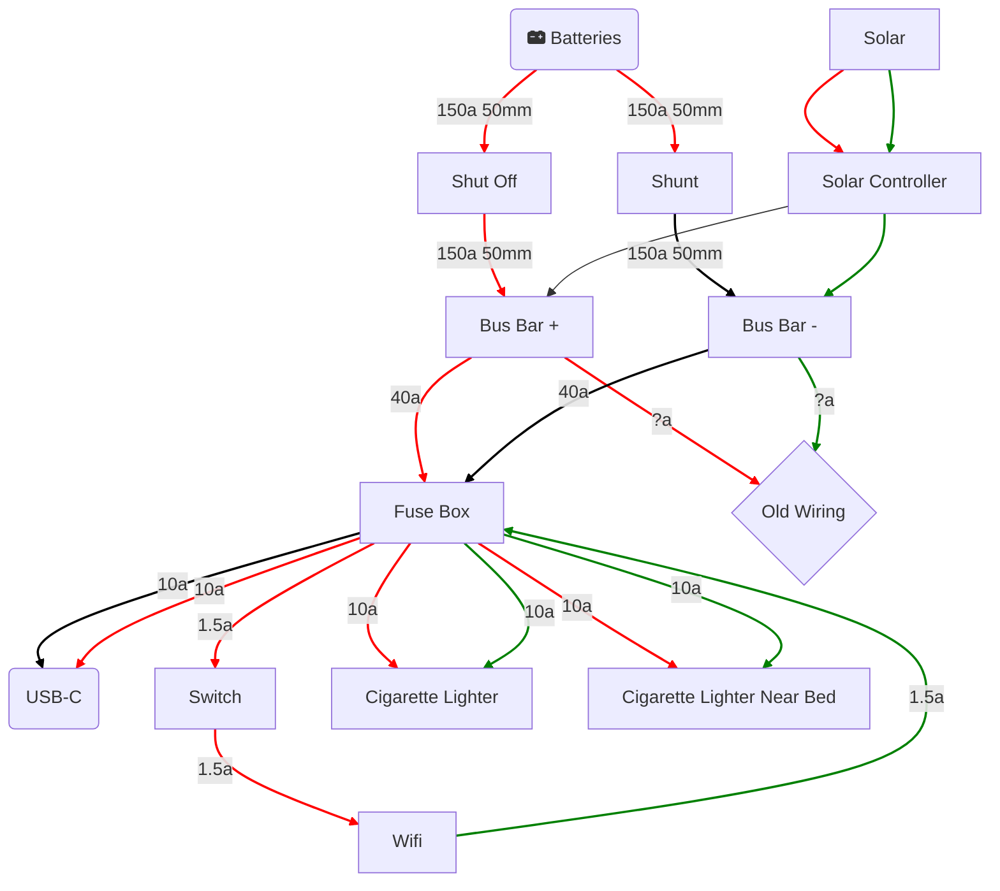

# `Mermaid`を使用したエンドポイントとモジュール構造の図示
プロジェクト全体の理解促進のために、GitHubでの表示にきちんと対応した形での`mermaid`によるアーキテクチャ図を書くバージョンごとに作成していく。\
最新バージョンが上になるようにする。

### Example(version:test)


---
以下から、各バージョンごとにexampleに沿った形式で、各APIやモジュールとエンドポイントの構成などを詳細に記載していくこと。
---

### v1.0.4 - クレジットカード項目管理システム・残高推移グラフ改善 (2025年8月30日)
```mermaid
graph TD
    %% フロントエンド層
    subgraph Frontend["Frontend Layer"]
        VUE[Vue.js 3.0 SPA<br/>リアクティブUI]
        CHART[Chart.js<br/>データ可視化]
        CSS[Glassmorphism<br/>CSS Design]
        SESSION[sessionStorage<br/>状態永続化]
        BALANCE_CHART[残高推移グラフ<br/>NEW フィルタリング対応]
    end

    %% 認証・セキュリティ層
    subgraph Security["Authentication & Security"]
        LOGIN_PAGE[ログイン画面<br/>login.html]
        AUTH_SYSTEM[認証システム<br/>bcrypt + Session]
        LOGIN_GUARD[@login_required<br/>認証デコレータ]
        IP_LIMIT[IP制限<br/>5回/30分]
    end

    %% APIエンドポイント層
    subgraph API["API Endpoints"]
        subgraph AuthAPI["認証API"]
            LOGIN_API[POST /api/login]
            LOGOUT_API[POST /api/logout]
            STATUS_API[GET /api/auth_status]
        end

        subgraph TransactionAPI["取引管理API"]
            GET_TXN[GET /api/transactions<br/>検索・フィルタ対応]
            POST_TXN[POST /api/transactions<br/>残高自動計算]
            PUT_TXN[PUT /api/transactions/id<br/>残高再計算]
            DELETE_TXN[DELETE /api/transactions/id<br/>残高再計算]
        end

        subgraph DataAPI["データ参照API"]
            GET_ACCOUNTS[GET /api/accounts<br/>口座一覧]
            GET_ITEMS[GET /api/items<br/>項目一覧]
            GET_BALANCE[GET /api/balance_history<br/>残高推移データ]
            GET_BALANCE_FILTERED[NEW GET /api/balance_history_filtered<br/>CCフィルタリング対応]
        end

        subgraph CreditCardAPI["NEW クレジットカード設定API"]
            GET_CC[NEW GET /api/credit_card_settings<br/>CC設定取得]
            POST_CC[NEW POST /api/credit_card_settings<br/>CC設定保存]
        end

        subgraph UtilityAPI["ユーティリティAPI"]
            BACKUP_CSV[GET /api/backup_csv<br/>CSVエクスポート]
            IMPORT_CSV[NEW POST /api/import_csv<br/>追加/置換モード対応]
            LOG_API[POST /api/log<br/>統合ログシステム]
            DOWNLOAD_LOG[GET /api/download_log<br/>ログダウンロード]
        end
    end

    %% ビジネスロジック層
    subgraph Business["Business Logic Layer"]
        subgraph CoreModules["コアモジュール"]
            APP_PY[app.py<br/>Flaskアプリファクトリ]
            MODELS_PY[models.py<br/>SQLAlchemy ORM]
            CONFIG_PY[config.py<br/>設定管理・ログシステム]
            UTILS_PY[utils.py<br/>ユーティリティ関数]
            AUTH_PY[auth.py<br/>認証システム]
        end

        subgraph Routes["Blueprintルート"]
            AUTH_ROUTES[auth_routes.py<br/>認証ルート]
            API_ROUTES[api_routes.py<br/>メインAPIロジック]
            MAIN_ROUTES[main_routes.py<br/>ページルート]
        end
    end

    %% データ永続化層
    subgraph Data["Data Persistence Layer"]
        subgraph Database["データベース"]
            SQLITE[(SQLite<br/>money_tracker.db)]
            TXN_TABLE[Transactionsテーブル<br/>id, account, date, item<br/>type, amount, balance]
        end

        subgraph FileStorage["ファイルストレージ"]
            CC_JSON[NEW credit_card_settings.json<br/>CCアイテム設定]
            LOG_FILES[ログファイル<br/>10MB x 5 ローテーション]
            BACKUP_FILES[CSVバックアップ<br/>最新3件保持]
        end
    end

    %% 接続関係
    VUE --> LOGIN_API
    VUE --> GET_TXN
    BALANCE_CHART -->|NEW 専用API| GET_BALANCE_FILTERED
    VUE --> GET_CC
    VUE --> POST_CC

    LOGIN_API --> AUTH_SYSTEM
    AUTH_SYSTEM --> LOGIN_GUARD
    LOGIN_GUARD --> API_ROUTES

    GET_BALANCE_FILTERED -->|NEW CCフィルタリング| CC_JSON
    API_ROUTES --> TXN_TABLE
    API_ROUTES --> CC_JSON
    API_ROUTES --> LOG_FILES

    VUE --> SESSION
    VUE --> CHART
    LOGIN_PAGE --> AUTH_SYSTEM

    %% スタイル定義
    classDef frontend fill:#e3f2fd,stroke:#1976d2,stroke-width:2px
    classDef security fill:#fff3e0,stroke:#f57c00,stroke-width:2px
    classDef api fill:#f3e5f5,stroke:#7b1fa2,stroke-width:2px
    classDef business fill:#e8f5e8,stroke:#388e3c,stroke-width:2px
    classDef data fill:#fff8e1,stroke:#fbc02d,stroke-width:2px
    classDef new fill:#ffebee,stroke:#d32f2f,stroke-width:3px,stroke-dasharray: 5 5

    %% クラス適用
    class VUE,CHART,CSS,SESSION frontend
    class BALANCE_CHART,GET_CC,POST_CC,GET_BALANCE_FILTERED,IMPORT_CSV,CC_JSON new
    class LOGIN_PAGE,AUTH_SYSTEM,LOGIN_GUARD,IP_LIMIT security
    class LOGIN_API,LOGOUT_API,STATUS_API,GET_TXN,POST_TXN,PUT_TXN,DELETE_TXN,GET_ACCOUNTS,GET_ITEMS,GET_BALANCE,BACKUP_CSV,LOG_API,DOWNLOAD_LOG api
    class APP_PY,MODELS_PY,CONFIG_PY,UTILS_PY,AUTH_PY,AUTH_ROUTES,API_ROUTES,MAIN_ROUTES business
    class SQLITE,TXN_TABLE,LOG_FILES,BACKUP_FILES data
```

### v1.0.3 - JSログ統合システム (2025年7月26日)
```mermaid
graph TD
    %% フロントエンド層
    subgraph Frontend["Frontend Layer"]
        VUE[Vue.js 3.0 SPA<br/>リアクティブUI]
        CHART[Chart.js<br/>データ可視化]
        CSS[Glassmorphism<br/>CSS Design]
        SESSION[sessionStorage<br/>状態永続化]
        LOG_JS[NEW 統合ログシステム<br/>JS → Python]
    end

    %% 認証・セキュリティ層
    subgraph Security["Authentication & Security"]
        LOGIN_PAGE[ログイン画面<br/>login.html]
        AUTH_SYSTEM[認証システム<br/>bcrypt + Session]
        LOGIN_GUARD[@login_required<br/>認証デコレータ]
        IP_LIMIT[IP制限<br/>5回/30分]
    end

    %% APIエンドポイント層
    subgraph API["API Endpoints"]
        subgraph AuthAPI["認証API"]
            LOGIN_API[POST /api/login]
            LOGOUT_API[POST /api/logout]
            STATUS_API[GET /api/auth_status]
        end

        subgraph TransactionAPI["取引管理API"]
            GET_TXN[GET /api/transactions<br/>検索・フィルタ対応]
            POST_TXN[POST /api/transactions<br/>残高自動計算]
            PUT_TXN[PUT /api/transactions/id<br/>残高再計算]
            DELETE_TXN[DELETE /api/transactions/id<br/>残高再計算]
        end

        subgraph DataAPI["データ参照API"]
            GET_ACCOUNTS[GET /api/accounts<br/>口座一覧]
            GET_ITEMS[GET /api/items<br/>項目一覧]
            GET_BALANCE[GET /api/balance_history<br/>残高推移データ]
        end

        subgraph UtilityAPI["ユーティリティAPI"]
            BACKUP_CSV[GET /api/backup_csv<br/>CSVエクスポート]
            LOG_API[NEW POST /api/log<br/>JS統合ログ受信]
            DOWNLOAD_LOG[GET /api/download_log<br/>ログダウンロード]
        end
    end

    %% ビジネスロジック層
    subgraph Business["Business Logic Layer"]
        subgraph CoreModules["コアモジュール"]
            APP_PY[app.py<br/>Flaskアプリファクトリ]
            MODELS_PY[models.py<br/>SQLAlchemy ORM]
            CONFIG_PY[config.py<br/>NEW 統合ログ設定]
            UTILS_PY[utils.py<br/>ユーティリティ関数]
            AUTH_PY[auth.py<br/>認証システム]
        end

        subgraph Routes["Blueprintルート"]
            AUTH_ROUTES[auth_routes.py<br/>認証ルート]
            API_ROUTES[api_routes.py<br/>メインAPIロジック]
            MAIN_ROUTES[main_routes.py<br/>ページルート]
        end
    end

    %% データ永続化層
    subgraph Data["Data Persistence Layer"]
        subgraph Database["データベース"]
            SQLITE[(SQLite<br/>money_tracker.db)]
            TXN_TABLE[Transactionsテーブル<br/>id, account, date, item<br/>type, amount, balance]
        end

        subgraph FileStorage["ファイルストレージ"]
            LOG_FILES[NEW 統合ログファイル<br/>JS+Python統合<br/>10MB x 5 ローテーション]
            BACKUP_FILES[CSVバックアップ<br/>最新3件保持]
        end
    end

    %% 接続関係
    VUE --> LOGIN_API
    VUE --> GET_TXN
    LOG_JS -->|NEW 統合ログ| LOG_API

    LOGIN_API --> AUTH_SYSTEM
    AUTH_SYSTEM --> LOGIN_GUARD
    LOGIN_GUARD --> API_ROUTES

    LOG_API -->|NEW 統合出力| LOG_FILES
    API_ROUTES --> TXN_TABLE
    API_ROUTES --> LOG_FILES

    VUE --> SESSION
    VUE --> CHART
    LOGIN_PAGE --> AUTH_SYSTEM

    %% スタイル定義
    classDef frontend fill:#e3f2fd,stroke:#1976d2,stroke-width:2px
    classDef security fill:#fff3e0,stroke:#f57c00,stroke-width:2px
    classDef api fill:#f3e5f5,stroke:#7b1fa2,stroke-width:2px
    classDef business fill:#e8f5e8,stroke:#388e3c,stroke-width:2px
    classDef data fill:#fff8e1,stroke:#fbc02d,stroke-width:2px
    classDef new fill:#ffebee,stroke:#d32f2f,stroke-width:3px,stroke-dasharray: 5 5

    %% クラス適用
    class VUE,CHART,CSS,SESSION frontend
    class LOG_JS,LOG_API,LOG_FILES new
    class LOGIN_PAGE,AUTH_SYSTEM,LOGIN_GUARD,IP_LIMIT security
    class LOGIN_API,LOGOUT_API,STATUS_API,GET_TXN,POST_TXN,PUT_TXN,DELETE_TXN,GET_ACCOUNTS,GET_ITEMS,GET_BALANCE,BACKUP_CSV,DOWNLOAD_LOG api
    class APP_PY,MODELS_PY,CONFIG_PY,UTILS_PY,AUTH_PY,AUTH_ROUTES,API_ROUTES,MAIN_ROUTES business
    class SQLITE,TXN_TABLE,BACKUP_FILES data
```

### v1.0.2 - フロントエンド・UI強化 (2025年7月)
```mermaid
graph TD
    %% フロントエンド層
    subgraph Frontend["Frontend Layer"]
        VUE[NEW Vue.js 3.0 本番ビルド<br/>パフォーマンス最適化]
        CHART[Chart.js<br/>NEW 動的サイジング対応]
        CSS[Glassmorphism<br/>NEW z-index管理強化]
        SESSION[NEW sessionStorage<br/>選択状態永続化]
        FAVICON[NEW SVGファビコン<br/>404対策]
    end

    %% 認証・セキュリティ層
    subgraph Security["Authentication & Security"]
        LOGIN_PAGE[ログイン画面<br/>login.html]
        AUTH_SYSTEM[認証システム<br/>bcrypt + Session]
        LOGIN_GUARD[@login_required<br/>認証デコレータ]
        IP_LIMIT[IP制限<br/>5回/30分]
    end

    %% APIエンドポイント層
    subgraph API["API Endpoints"]
        subgraph AuthAPI["認証API"]
            LOGIN_API[POST /api/login]
            LOGOUT_API[POST /api/logout]
            STATUS_API[GET /api/auth_status]
        end

        subgraph TransactionAPI["取引管理API"]
            GET_TXN[GET /api/transactions<br/>検索・フィルタ対応]
            POST_TXN[POST /api/transactions<br/>残高自動計算]
            PUT_TXN[PUT /api/transactions/id<br/>残高再計算]
            DELETE_TXN[DELETE /api/transactions/id<br/>残高再計算]
        end

        subgraph DataAPI["データ参照API"]
            GET_ACCOUNTS[GET /api/accounts<br/>口座一覧]
            GET_ITEMS[GET /api/items<br/>項目一覧]
            GET_BALANCE[GET /api/balance_history<br/>残高推移データ]
        end

        subgraph UtilityAPI["ユーティリティAPI"]
            BACKUP_CSV[GET /api/backup_csv<br/>CSVエクスポート]
            DOWNLOAD_LOG[GET /api/download_log<br/>ログダウンロード]
        end
    end

    %% ビジネスロジック層
    subgraph Business["Business Logic Layer"]
        subgraph CoreModules["コアモジュール"]
            APP_PY[app.py<br/>Flaskアプリファクトリ]
            MODELS_PY[models.py<br/>SQLAlchemy ORM]
            CONFIG_PY[config.py<br/>設定管理・ログシステム]
            UTILS_PY[utils.py<br/>ユーティリティ関数]
            AUTH_PY[auth.py<br/>認証システム]
        end

        subgraph Routes["Blueprintルート"]
            AUTH_ROUTES[auth_routes.py<br/>認証ルート]
            API_ROUTES[api_routes.py<br/>メインAPIロジック]
            MAIN_ROUTES[main_routes.py<br/>ページルート]
        end
    end

    %% データ永続化層
    subgraph Data["Data Persistence Layer"]
        subgraph Database["データベース"]
            SQLITE[(SQLite<br/>money_tracker.db)]
            TXN_TABLE[Transactionsテーブル<br/>id, account, date, item<br/>type, amount, balance]
        end

        subgraph FileStorage["ファイルストレージ"]
            LOG_FILES[ログファイル<br/>ローテーション機能]
            BACKUP_FILES[CSVバックアップ<br/>最新3件保持]
        end
    end

    %% 接続関係
    VUE --> LOGIN_API
    VUE --> GET_TXN
    VUE --> GET_BALANCE

    LOGIN_API --> AUTH_SYSTEM
    AUTH_SYSTEM --> LOGIN_GUARD
    LOGIN_GUARD --> API_ROUTES

    API_ROUTES --> TXN_TABLE
    API_ROUTES --> LOG_FILES

    VUE --> SESSION
    VUE --> CHART
    VUE --> FAVICON
    LOGIN_PAGE --> AUTH_SYSTEM

    %% スタイル定義
    classDef frontend fill:#e3f2fd,stroke:#1976d2,stroke-width:2px
    classDef security fill:#fff3e0,stroke:#f57c00,stroke-width:2px
    classDef api fill:#f3e5f5,stroke:#7b1fa2,stroke-width:2px
    classDef business fill:#e8f5e8,stroke:#388e3c,stroke-width:2px
    classDef data fill:#fff8e1,stroke:#fbc02d,stroke-width:2px
    classDef new fill:#ffebee,stroke:#d32f2f,stroke-width:3px,stroke-dasharray: 5 5

    %% クラス適用
    class VUE,CHART,CSS,SESSION,FAVICON new
    class LOGIN_PAGE,AUTH_SYSTEM,LOGIN_GUARD,IP_LIMIT security
    class LOGIN_API,LOGOUT_API,STATUS_API,GET_TXN,POST_TXN,PUT_TXN,DELETE_TXN,GET_ACCOUNTS,GET_ITEMS,GET_BALANCE,BACKUP_CSV,DOWNLOAD_LOG api
    class APP_PY,MODELS_PY,CONFIG_PY,UTILS_PY,AUTH_PY,AUTH_ROUTES,API_ROUTES,MAIN_ROUTES business
    class SQLITE,TXN_TABLE,LOG_FILES,BACKUP_FILES data
```
