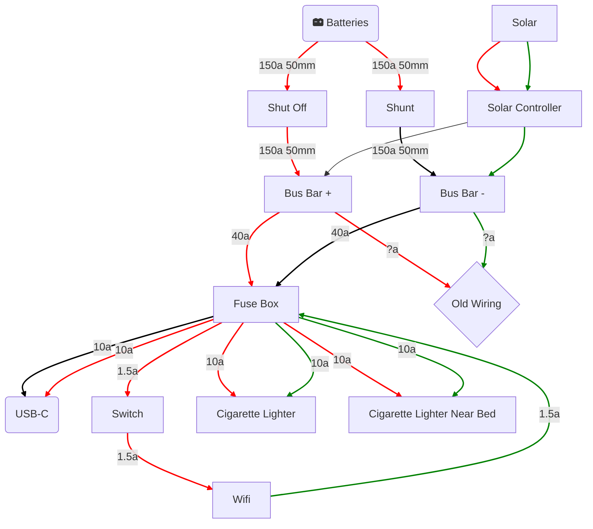

# `Mermaid`を使用したエンドポイントとモジュール構造の図示
プロジェクト全体の理解促進のために、GitHubでの表示にきちんと対応した形での`mermaid`によるアーキテクチャ図を書くバージョンごとに作成していく。\
最新バージョンが上になるようにする。

### Example(version:test)

---
以下から、各バージョンごとにexampleに沿った形式で、各APIやモジュールとエンドポイントの構成などを詳細に記載していくこと。
---
